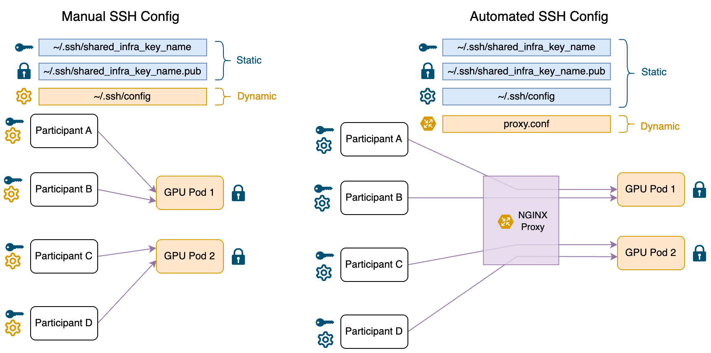

# gpu-fleet

Get a room full of people onto GPUs in minutes.

> **Based on [nickypro/arena-infra](https://github.com/nickypro/arena-infra)**, the
> infrastructure behind the [ARENA](https://www.arena.education) bootcamps. The whole
> design comes from it — pre-provisioned pods, one shared SSH key, and an nginx proxy
> that gives every pod name a permanent port — and so do many of the scripts here,
> some of them nearly unchanged. gpu-fleet is that project with the ARENA-specific
> parts removed and changes from running it for later programs added: see
> [Credits](#credits).

An organizer provisions one GPU pod per person (or pair) before a session starts.
Participants do a five-minute setup **once** and then connect with `ssh gpu-alder`,
or with VS Code / Cursor Remote-SSH, every time after that. No provider accounts, no
credit cards and no per-person dashboards for them. The organizer creates, checks and
tears down the whole fleet with a handful of commands.

It's built for programs with scheduled sessions: bootcamps, workshops, weekly
upskilling or research sprints. The trade-off is that participants don't manage
their own GPUs. The organizer (or Claude, running on the proxy box) does that for
them.

## How it works



- **Pods** run on [RunPod](https://www.runpod.io) (optionally also
  [Vast.ai](https://vast.ai)), named `<prefix>-<name>`: `gpu-alder`, `gpu-birch`, …
  from `MACHINE_NAME_LIST` in `config.env`.
- **One shared SSH key** is trusted by every pod, and every participant gets a copy.
- **An nginx proxy** on a small always-on server gives each *name* a fixed port
  (`gpu-alder` → port 16000, `gpu-birch` → 16001, …). Pods come and go with new IP
  addresses every time; `update_proxy` re-points the ports at whatever is live.
- So each participant's `~/.ssh/config` **never changes**: it maps each name to the
  proxy host and that name's port. Whoever sits at "alder" today runs `ssh gpu-alder`.

## What you need

- A **RunPod account** with credit and an API key (Settings → API Keys). Accounts are
  prepaid: turn on auto-top-up, or an empty balance stops every pod mid-session.
- An **always-on Linux server** with a public IP to be the proxy: any small VPS
  (1 vCPU / 1 GB is plenty). It needs inbound TCP open for one port per name, starting
  at `SSH_PROXY_STARTING_PORT` (16000–16029 for the default 30 names).
- Optional: a **Vast.ai** account and API key, as a second source of GPUs.

## One-time setup (organizer)

Run everything below on the proxy server as a user with sudo (root is simplest).

```bash
# 1. Get the code
git clone <this repo's URL> ~/gpu-fleet && cd ~/gpu-fleet

# 2. Python environment for the scripts (standard library only, plus optional vastai)
bash proxy/install_python_venv.sh && source ~/.bashrc
pip install vastai                      # only if you'll use Vast.ai

# 3. nginx, set up as the SSH proxy
bash proxy/setup_nginx.sh

# 4. Settings
cp config.env.example config.env        # then edit it — see "Configuration" below

# 5. A new shared SSH key for this program (never reuse one from elsewhere)
ssh-keygen -t ed25519 -N "" -C "program shared key" -f ~/.ssh/program_shared
#    ...and make SHARED_SSH_KEY_PATH in config.env match that path.

# 6. Put the commands on your PATH (list_pods, burst_create_pods, podcheck, ...)
sudo ./install.sh

# 7. Let this server reach the pods the same way participants do
ssh_config >> ~/.ssh/config
```

Open the proxy port range in your server's firewall (for example
`ufw allow 16000:16029/tcp`, and the same in your cloud provider's firewall panel).

**Test it end to end with one pod** before inviting anyone:
```bash
burst_create_pods alder --max-price 0.30
list_pods                # wait until alder shows an IP instead of N/A (2–5 min)
update_proxy
podcheck alder           # want:  OK   (cuda: yes)
nuke_pods --include alder
```

## One-time setup (participants)

Send each participant two things: the private key (`show_key` prints it) and the
config block (`ssh_config` prints it). Then they:

1. Save the key as `~/.ssh/<same filename as SHARED_SSH_KEY_PATH>`, e.g.
   `~/.ssh/program_shared`, and restrict it: `chmod 600 ~/.ssh/program_shared`
   (on Windows, the file must be readable only by their own user).
2. Paste the config block at the end of `~/.ssh/config` (create the file if needed).
3. Connect to the pod they're assigned: `ssh gpu-alder`. In VS Code or Cursor:
   *Remote-SSH: Connect to Host…* → `gpu-alder`.

That's it for the whole program. If the key or proxy host ever changes, they redo
steps 1–2.

A good way to catch setup problems early: keep one pod running before the first
session (`keepalive_pod alder`) and ask everyone to connect to it once.

## Each session

**Before people arrive** (pods take 5–20 minutes to become usable, so start early):
```bash
burst_create_pods -n 12 --max-price 0.50   # 12 pods on any GPU type under $0.50/hr
list_pods                                   # wait until every pod has an IP
update_proxy                                # point the proxy at the new IPs
podcheck                                    # every pod should say "OK (cuda: yes)"
deploy_keys                                 # only if pods need API keys (see below)
```
`management/pod_pipeline.sh alder birch …` does the list → proxy → check → keys steps
for each pod independently, so one slow pod doesn't hold up the others.

A pod that fails `podcheck` (`FAIL`, or `cuda: NO`) is almost always a bad machine.
Destroy it (`nuke_pods --include <name>`) and create it again. Switching GPU type is
the most reliable way to land on a different machine.

**After the session:**
```bash
nuke_pods        # stop and destroy every running pod
delete_pods      # remove any stopped pods left over
```

> **Pods keep nothing when they're stopped or destroyed.** Tell participants to push
> their work to GitHub or HuggingFace before the session ends. For work that must
> persist between sessions, use a network volume (`create_volume_pod`, see
> `NETWORK_VOLUMES.md`).

## Commands

| Command | What it does |
|---|---|
| `burst_create_pods` | Create pods, retrying across GPU types until each one lands. **The default way to create.** `-n N` (first N names), `-a N` (N more), or names; `--max-price`. |
| `create_pods` | Create pods with one attempt each (prompts y/N). Usually `burst_create_pods` is better. |
| `create_vast_pods` | Create pods on Vast.ai. |
| `create_volume_pod` | Create a pod on a persistent network volume. |
| `list_pods` | Every pod on both providers, with IPs and total hourly cost. |
| `fleet_report` | How long each pod has been up and roughly what it has cost. |
| `fleet_status` | One line per name: has an IP, no IP yet, or missing. |
| `update_proxy` | Point the proxy at the current pod IPs. Run after pods are created or replaced. |
| `podcheck [names]` | Check each pod is reachable through the proxy and its GPU works. |
| `deploy_keys` | Copy API keys from `keys/` onto every running pod. |
| `ssh_config` | Print the SSH config block for participants. |
| `show_key` | Print the shared private key for participants. |
| `stop_pods` | Stop running pods (keeps nothing; only pauses billing). |
| `delete_pods` | Delete stopped pods. |
| `nuke_pods` | **Stop and destroy running pods, no prompts.** |
| `keepalive_pod <name>` | Keep one pod up and healthy, replacing it if needed. |

The stop/delete/nuke commands take `--include name …` or `--exclude name …`. Names
can be bare (`alder`) or prefixed (`gpu-alder`). `CLAUDE.md` has the full option
reference.

## API keys on the pods (optional)

To give each pod API keys (OpenRouter, OpenAI, Anthropic, HuggingFace), put
two-column CSVs in `keys/` — full pod name, then key:

```
gpu-alder,sk-or-v1-...
gpu-birch,sk-or-v1-...
```

The files are `keys/openrouter_api_keys.csv`, `openai_api_keys.csv`,
`anthropic_api_keys.csv` and `huggingface_api_keys.csv`. Any you don't need can be
left out. Then run `deploy_keys`. On each pod the keys land in `/root/.env`, are
loaded into every new shell, and are set in `os.environ` in every Jupyter kernel.

For per-pod OpenRouter keys with individual spending caps,
`management/generate_openrouter_keys.py` mints them from an OpenRouter provisioning
key, and `management/openrouter_spend_report.py` reports their spend (and can
disable them at the end of the program).

## Configuration (`config.env`)

| Setting | Meaning |
|---|---|
| `RUNPOD_API_KEY`, `VASTAI_API_KEY` | Provider keys. Leave Vast blank to use RunPod only. |
| `SHARED_SSH_KEY_PATH` | The shared key (the `.pub` next to it is put on every pod). |
| `MACHINE_NAME_PREFIX` | Pods are named `<prefix>-<name>`. Something short and specific to your program. |
| `MACHINE_NAME_LIST` | The names, in order. **Only ever add names at the end:** each name's position decides its proxy port, and participants' configs depend on it. |
| `RUNPOD_GPU_TYPE`, `RUNPOD_CLOUD_TYPE`, `RUNPOD_NUM_GPUS` | Defaults for `create_pods`. |
| `RUNPOD_DOCKER_IMAGE` | Pod image. The default is RunPod's official PyTorch image. Any image works if it starts sshd from the `PUBLIC_KEY` environment variable, as RunPod's official images do. |
| `RUNPOD_DISK_SPACE_IN_GB`, `RUNPOD_VOLUME_SPACE_IN_GB` | Container disk and persistent pod volume sizes. |
| `POD_SETUP_CMD` | Optional shell command run at every pod start (e.g. `cd /root/course && git pull`). |
| `POD_PYTHON` | Python on the pods, used by `podcheck`'s GPU check. |
| `POD_ENV_FILE` | Where `deploy_keys` writes keys on each pod. |
| `KEY_COHORT` | Label for per-pod OpenRouter keys; change it each program. |
| `SSH_PROXY_HOST`, `SSH_PROXY_STARTING_PORT` | The proxy server's address, and the port for the first name. |

## Costs

You pay the provider per second for each running pod, plus a little for storage.
Cheap cards (RTX A4000 / A5000 / 3090) cost about $0.17–0.30/hr on RunPod's community
cloud, so 15 pods for a 5-hour session come to about $15–20. A100s and H100s cost
several times that per GPU, so they dominate any bill. Create them only when the work
needs them, and never leave them idle. `list_pods` shows the current hourly total;
`fleet_report` shows the cost so far. The proxy server is a few dollars a month.

## Security

- **Use a new shared SSH key for each program**, and never use it for anything else.
  Everyone holds it, and every pod trusts it.
- **Keys stay out of git**: `config.env` and `keys/` are gitignored.
- Prefer RunPod over Vast.ai's community hosts for anything sensitive. Community hosts
  are third-party machines.

## Files

```
bin/            the shortcut commands (install.sh symlinks these onto your PATH)
management/     the scripts behind them; runpod_compat.py is the RunPod API client
proxy/          nginx proxy: config generator, update script, one-time setup
docs/           diagram
config.env.example   copy to config.env
OPS_PLAYBOOK.md      how to run sessions well, and the costly mistakes to avoid
NETWORK_VOLUMES.md   persistent storage for pods
CLAUDE.md            notes for Claude (and a full command reference)
```

The scripts talk to RunPod's REST API (v2) directly through
`management/runpod_compat.py`. They don't need the `runpod` pip package.

## Credits

gpu-fleet is derived from **[nickypro/arena-infra](https://github.com/nickypro/arena-infra)**
by Nicky Pochinkov and contributors, the infrastructure behind the [ARENA](https://www.arena.education)
bootcamps. From arena-infra come the architecture (pods named from a fixed list, a shared
SSH key, and an nginx stream proxy mapping each name to a permanent port), the diagram, and
the core scripts: creating, listing, stopping and destroying pods, generating SSH configs,
and the nginx proxy configuration.

Changes since then, made while running it for later programs:
- `burst_create_pods`, which retries across GPU types when capacity is tight
- CUDA health checks (`podcheck`), per-pod bring-up (`pod_pipeline.sh`), `fill_fleet.sh`
  and `keepalive_pod.sh`
- Vast.ai support, network-volume pods, `deploy_keys`, per-pod OpenRouter keys, and cost
  reports
- a RunPod REST API v2 client (`runpod_compat.py`) replacing the pip SDK, whose GraphQL API
  RunPod is retiring
- the ARENA-specific parts taken out (the ARENA image and curriculum hooks, notebook
  patches, cohort tooling), and settings and docs made program-neutral

arena-infra has no license, so ask its author before sharing or reusing this code.
